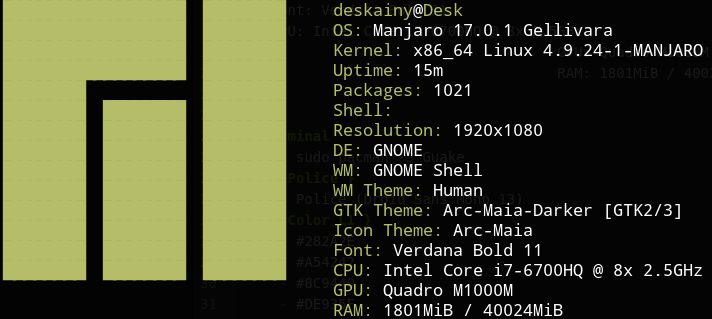

# WorkSpace
## Linux
     - Manjaro x86_64 (Gnome Edition)
     - </img>

## Terminal
     - sudo pacman -S Guake
### { Police }
     - Police (Droid Sans Mono 13)
### { Color L1 }
     - #282A2E
     - #A54242
     - #8C9440
     - #DE935F
     - #5F819D
     - #85678F
     - #5E8D87
     - #707880
###  { Color L2 }
     - #373B41
     - #CC6666
     - #B5BD68
     - #F0C674
     - #81A2BE
     - #B294BB
     - #8ABEB7
     - #C5C8C6
## Zsh && OhMyZsh
     - sudo pacman -S Zsh
     - h
## Vim
     - sudo pacman -S vim
     - echo "set nu" >> ~/.vimrc

## Space-Vim
     - sh -c "$(curl -fsSL https://raw.githubusercontent.com/liuchengxu/space-vim/master/install.sh)"
