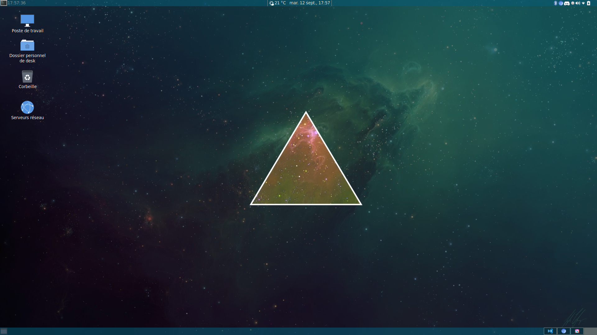

# Mon environement de travail
<h1>ScreenFetch</h1>

<br>
<h1>Desktop</h1>

<hr/>

## Installation
> Installer git ou télécharger l'archive.
## Par Archive 
```bash
# Download archive
wget https://github.com/dorianWilhelm/dotfiles/archive/master.zip
# unzip archive
unzip master.zip
cd dotfiles-master
# give privilage execution
chmod +x install.sh
# execute the script
./install.sh
```
<hr>
## Par Git

### -   https

```bash
# clone the repository
git clone https://github.com/dorianWilhelm/dotfiles.git
cd dotfiles-master
# give privilage execution
chmod +x install.sh
# execute the script
./install.sh
```

### -   Ssh
```bash
# clone the repository
git clone git@github.com:dorianWilhelm/dotfiles.git
cd dotfiles-master
# give privilage execution
chmod +x install.sh
# execute the script
./install.sh
```

---
## informations
```text
    Script d'installation créé sous Archlinux, utilisant mate-desktop and gdm.

    N'utilisez pas ce script, si vous n'etes pas sous Archlinux utilisant mate-desktop et gdm cela risque de faire bugger votre système d'exploitation.
```

```text
    Se script va nettoyer les fichiers et redemarrer votre ordinateur à la fin de sont installation.
```